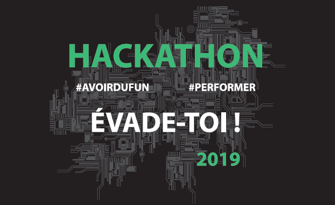

# Dialog Insight Hackathon 2019

Welcome to the official Dialog Insight Hackathon 2019 repository.

You can find the terms and conditions [here](docs/TheHackathon.md).

## Slack Channel

To ease some communications during the hackathon we invite you to join us the [DI-Hackathon-2019 slack channel](https://di-hackathon-2019.slack.com/).

## Starter kit

This repository contains a simple vue.js boilerplate to help you get your hackathon started :rocket:

This app uses an API to manage users authentication and and get maze definition.

You can find the API documentation [here](https://labyrinth-api.herokuapp.com/api-docs/) :book: and the base URL for queries is https://labyrinth-api.herokuapp.com/.

## Deploying the app

Go to [this document](docs/Deploy.md) to see one way to deploy the app.

## Real time capabilities

To add real time features to your maze, we recommand to use [firebase](https://firebase.google.com/products/realtime-database/) + [vuefire](https://vuefire.vuejs.org/) :fire:

## Prerequisites

- [Node.js 12.0+](http://nodejs.org)
- [Visual studio code](https://code.visualstudio.com/)
- [Git](https://git-scm.com/)
- Vue cli (npm install -g @vue/cli)
- Eslint (npm install -g eslint)

## Getting Started

Begin by forking this repo and cloning your fork. You can use the [GitHub app](https://desktop.github.com/) to make it easier.

## Available scripts

To run the app

```
npm run serve
```

To lint and fix code style

```
npm run lint
```

To compile and minify for production

```
npm run build
```
